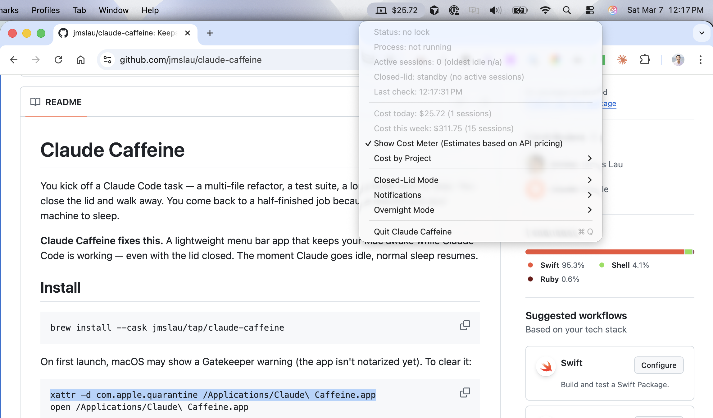
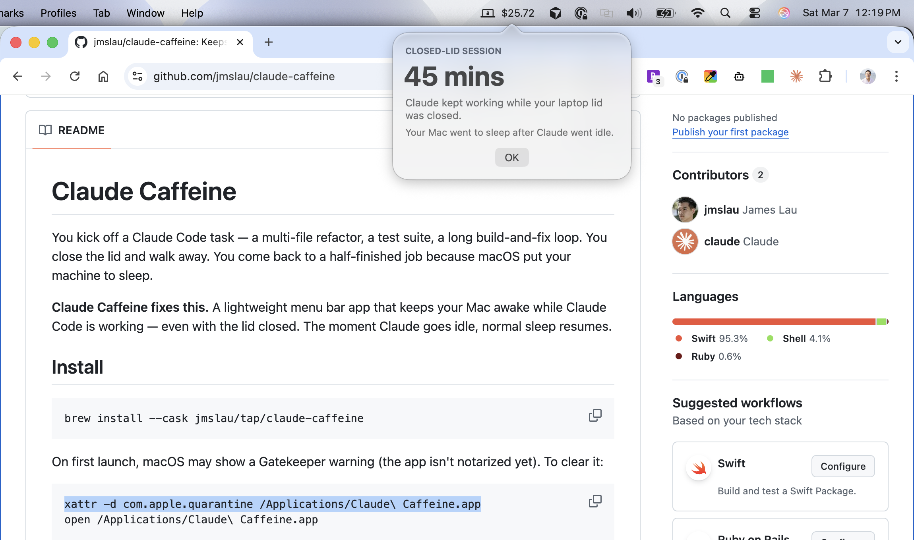

# Claude Caffeine 


**Problem:** You start a Claude Code task or an army of Claude Code agents, then you realize you need to step away. You can't close your Mac laptop because it would stop Claude from running. You have 2 bad options - do you walk around with your laptop open or do you stop Claude?

**Solution:** Claude Caffeine is a lightweight menu bar app that keeps your Mac awake *only* while Claude Code is working — including with the **lid closed**. The moment Claude goes idle, normal sleep resumes. No config, no account, runs entirely locally.


---

## Key Features

| | |
|---|---|
| **Close the lid, keep Claude running** | Close your MacBook and walk away. Claude keeps working. When Claude goes idle, your Mac will go to sleep. When you open the lid, a popover shows how long it ran while closed. |
| **See your API spend at a glance** | Menu bar shows cost today and this week; submenu breaks it down by project. For **API users only** (pay-per-token); estimates use Anthropic’s published rates. |

Plus: task-completion notifications with sound, configurable keep-awake timer for Claude Remote sessions, low-battery protection, and clean shutdown so sleep always restores on quit.

---

## Install


**macOS 13 (Ventura) or later.**

```bash
brew install --cask jmslau/tap/claude-caffeine
xattr -d com.apple.quarantine /Applications/Claude\ Caffeine.app
open /Applications/Claude\ Caffeine.app
```

The `xattr` command clears the macOS Gatekeeper warning (the app isn’t notarized yet). Or go to **System Settings → Privacy & Security** and click **Open Anyway** after the first launch attempt.

### Upgrade

```bash
brew upgrade --cask jmslau/tap/claude-caffeine
xattr -d com.apple.quarantine /Applications/Claude\ Caffeine.app
open /Applications/Claude\ Caffeine.app
```

If `brew upgrade` fails with "App source is not there", run `brew uninstall --cask claude-caffeine` then reinstall with the install command above.

<details>
<summary>Build from source</summary>

```bash
git clone https://github.com/jmslau/claude-caffeine.git
cd claude-caffeine
swift build -c release
./scripts/make-app-bundle.sh
cp -r dist/Claude\ Caffeine.app /Applications/
open /Applications/Claude\ Caffeine.app
```

</details>

---

## How it works

Every 5 seconds the app checks two signals:

1. **Process** — Running `claude` processes, CPU usage, and network connections. Active connections or >5% CPU = Claude is working.
2. **Files** — Recent changes under `~/.claude/tasks/`. Catches tool runs when the API is briefly idle.

If *either* signal is active, the Mac stays awake. When *both* go quiet, the sleep lock is released.

---

## Closed-lid mode

The standout feature: your MacBook stays awake with the lid shut while Claude is working. When you open the lid, you get a clear summary of how long Claude ran while it was closed.



On first launch you’ll be prompted to install a small privileged helper (admin password once). You can skip it — the app still prevents idle sleep, just not lid-close sleep. Install or remove it anytime from the menu.

**Under the hood:** A scoped sudoers entry lets your user run a script that toggles `pmset disablesleep`. Lid state comes from the IOKit clamshell sensor, so it’s reliable regardless of display settings.

**Thermal note:** With the lid closed, cooling is reduced. Use a hard surface or stand for long sessions.

**If the app exits without cleanup:**

```bash
sudo pmset -a disablesleep 0
```

---

## Session cost tracking (API users)

The app reads Claude Code session logs (`~/.claude/projects/`) to estimate API cost from token usage. In the menu bar you see:

- **Cost today** and session count  
- **Cost this week** (rolling 7 days)  
- **Cost by project** in a submenu  

Pricing uses Anthropic’s pay-per-token rates for Opus, Sonnet, and Haiku (including cache read/write). Each message is costed by its own model, so mixed-model sessions are accurate. Costs refresh every 30 seconds.

> **Note:** These are estimates for **API (pay-per-token) usage**. If you’re on Claude Pro or Max, the numbers won’t match your actual bill.

You can hide the cost meter from the menu: **Show Cost Meter** toggle.

---

## Keep Awake After Idle

By default, your Mac sleeps as soon as Claude goes idle. If you're using **Claude Remote** (controlling Claude Code from your phone), you may want the Mac to stay awake longer — or indefinitely.

From the menu, choose **Keep Awake After Idle** and pick a duration:

| Option | Use case |
|--------|----------|
| **Off** (default) | Mac sleeps when Claude goes idle |
| **1–4 Hours** | Lid closed in your backpack; saves battery |
| **12 Hours** | Overnight unattended session |
| **Forever** | Plugged in at home, using Claude Remote all day |

The menu shows a countdown while idle. Low-battery protection still applies regardless of the setting.

---

## Menu bar

| Icon | Meaning |
|------|--------|
| Animated bolt | Claude is working — Mac is being kept awake |
| Padlock on laptop | Closed-lid mode on, waiting for activity |
| Moon with zzz | Idle — no active Claude Code sessions |
| Warning triangle | Scan issue — lock held during grace period |

The menu shows live status: process state, active sessions, closed-lid state, today/week cost (if enabled), and last check time.

---

## Configuration

- **Keep Awake After Idle** — How long to hold the sleep lock after Claude goes idle (Off, 1h, 2h, 4h, 12h, Forever).
- **Show Cost Meter** — Show or hide the cost display in the menu bar (on by default).
- **Notifications** — Toggle completion notifications and sound separately.

---

## Development

```bash
swift build          # debug build
swift test           # run tests
swift run            # run from source
```

Release build and cask update:

```bash
./scripts/release.sh X.X.X
```

---

## Changelog

### v1.3.1

- **Thermal protection** — Releases the sleep lock and suspends closed-lid mode when macOS reports a critical thermal state, letting your Mac cool down automatically.

### v1.3.0

- **Keep Awake After Idle** — Designed for Claude Remote sessions, you can now keep your computer awake even after Claude goes idle. Configurable timer (1h, 2h, 4h, 12h, Forever) to hold the sleep lock after Claude becomes idle. 
- **Auto-dim screen when lid is closed** - Save more battery. While Claude Caffeine will keep your laptop awake to run Claude, it will auto dim the screen when the lid is closed to save battery. When you open your lid again, it will automatically resume to the previous brightness.

### v1.2.2

- **Closed-lid popover redesign** — Duration in large bold text for quick reading.
- **Improved duration formatting** — "15 sec", "9 mins 11 sec", or "2 hours 13 mins".
- **Lower summary threshold** — Popover after 10 seconds of closed-lid activity (was 60).
- **IOKit lid detection** — Uses hardware clamshell sensor for reliability when `pmset disablesleep` is active.

### v1.2.1

- **App icon** — Custom coffee cup + lightning bolt in Claude terracotta.
- **App renamed** — "Claude Caffeine.app" in Applications.
- **Gatekeeper** — Added `xattr` instructions for unsigned app warning.

### v1.2.0

- **Closed-lid summary popover** — Shows how long Claude ran while the lid was closed when you open it.

### v1.1.1

- **Show Cost Meter toggle** — Hide/show cost in menu bar; API pricing disclaimer.

### v1.1.0

- **Session cost tracking** — From `~/.claude/projects/` JSONL; per-model pricing including cache tokens.
- **Cost by project** — Submenu with per-project breakdown.
- **Task completion notifications** — Notification + sound with duration and cost delta.
- **Animated menu bar icon** — Bolt animates when Claude is active; live today cost.
- **Per-model pricing** — Accurate for mixed-model sessions.
- **API pricing disclaimer** — Cost estimates for pay-per-token API users only.

### v1.0.0

- Initial release: sleep prevention, closed-lid mode, detection, low battery protection, clean shutdown.

---

## Uninstall

```bash
brew uninstall claude-caffeine
```

If you installed the closed-lid helper, remove it first via **Closed-Lid Mode → Uninstall Helper**, or:

```bash
sudo rm /private/etc/sudoers.d/claude_caffeine
rm -rf ~/Library/ClaudeCaffeine
```

---

## License

MIT
